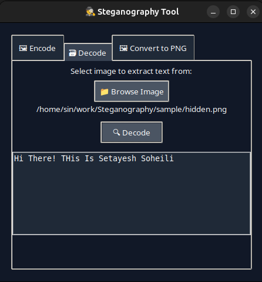

# Steganography Tool

#### Video Demo: https://youtu.be/wvBCzq1HGRc?si=39YOKYijhW5MGdhW

---

## Description

This project is a graphical steganography application built in Python that allows users to hide secret messages inside images, retrieve those hidden messages, and convert images into PNG format for lossless processing. Steganography is the art of concealing information within other non-secret data so that the hidden message is not detectable to a casual observer.

I created this tool because I wanted to explore how digital images can be used to carry secret messages securely and to learn more about image processing and graphical user interfaces in Python. The program uses the least significant bit (LSB) technique to embed text messages into images. This means the message bits are hidden within the smallest parts of each pixel’s color data, so the image looks almost identical to the original.

The tool is simple yet effective and includes three main functions: encoding text into images, decoding text from images, and converting images from various formats like JPEG or BMP into PNG format. The GUI is built with Tkinter, providing a clean and intuitive interface with three tabs for each function.

Through this project, I improved my skills in Python GUI development, image processing with Pillow and NumPy, and modular programming practices. I also learned the importance of clear user interfaces and how to handle file operations safely to avoid overwriting data.

Some challenges I faced were ensuring that the encoding process did not distort the image noticeably and handling different image formats reliably. I resolved these by limiting encoding to PNG images and providing a conversion tool to convert any image to PNG before encoding.

The modular design separates the GUI code from the core steganography logic, making the program easier to maintain and extend. For example, adding support for new image formats or more advanced hiding techniques would be straightforward in this structure.

---

## Project Structure

- `main.py`: The main program that launches the GUI and manages the interaction between different components.
- `steg_logic.py`: Contains the essential functions for converting text to binary, embedding messages in images, and extracting messages.
- `gui/encode_tab.py`: The interface and logic for the encoding tab where users can hide text in images.
- `gui/decode_tab.py`: The interface and logic for the decoding tab where users can extract hidden messages.
- `gui/convert_tab.py`: The interface and logic for converting images to PNG format.
- `gui/__init__.py`: Initializes the `gui` package.

---

## How to Run

1. Make sure Python 3.x is installed on your system.
2. Install the required packages using:

   ```bash
   pip install pillow numpy
````

3. Run the application by executing:

   ```bash
   python main.py
   ```
4. Use the GUI to select your input images, encode or decode messages, or convert image formats.

---

## Screenshots

### Encode


### Decode


### Convert


### Example Output



---

**Author:** Setayesh SoheilNezhad
**GitHub:** [sin-soheili](https://github.com/sin-soheili)
**edX:**[S-soheili](https://profile.edx.org/u/S-soheili)
**Location:** Gorgan, Golestan Province, Iran
**Date:** 2025-07-21

